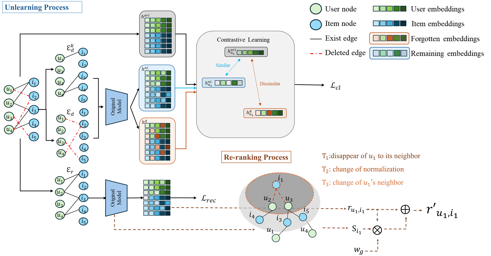

# RCU：Recommendation Contrastive Unlearning

#### Authors: 
- [Tzu-Hsuan Yang]() (tzuhsuan1010@gmail.com)
- [Cheng-Te Li]() (chengte@ncku.edu.tw)

## Overview 
This repository contains the code to preprocess datasets, train GNN models, and perform unlearn on trained GNN models. We integrate contrastive learning into recommendation unlearning to enhance privacy protection, aligning with user rights and evolving privacy standards.
<p align="center">
    
</p>

## Abstract
Recommender systems require on-demand unlearning of user-item interactions to meet privacy regulations without sacrificing recommendation quality. Existing approaches either retrain large models at prohibitive cost or apply local parameter tweaks that misestimate non-linear effects, resulting in degraded accuracy, poor scalability for bulk deletions, and no formal privacy auditing. We present \tha{ReCUR}, a \textit{Recommendation Contrastive Unlearning} framework with Influence Estimation that addresses these weaknesses. ReCUR first computes a single, batched influence estimate to subtract deleted interactions' contributions from the model, then applies a contrastive push-pull loss to push forgotten interaction embeddings away and pull retained ones back toward their original anchors. This yields fine-grained forgetting control, minimizes collateral drift, and recovers lost utility without full retraining. To promote fairness, ReCUR introduces a re-ranking mechanism with group-specific promotion weights that rebalance recommendations for diverse and niche user segments. Across four real-world datasets, ReCUR matches or exceeds retrain-from-scratch accuracy, retaining over 95\% utility even after deleting up to 20\% of interactions, while achieving up to an order-of-magnitude speed-up. Membership-inference audits confirm ReCUR's unlearned models are indistinguishable from fresh retrains, offering strong empirical privacy guarantees. Our further analysis reveals intuitive trade-offs between forgetting strength and utility, and shows that promoting under-represented users enhances overall accuracy.

## Datasets
Please run the following command to do train-test split. 
preprae_dataset.py for MovieLen100K, Douban, MovieLens1M. 
preprae_dataset_deg.py for AmazonBook. 
```
preprae_dataset.py
preprae_dataset_deg.py
```
## Requirements
The dataset used in RCU requires torch_geometric>=2.4.0. Please pay extra attention to this part.
```python
pip install numpy 
pip install pandas
pip install torch==1.13.1
pip install torch_geometric==2.4.0
pip install torch-cluster==1.6.1+pt113cu117
```
## Experimental setups-
To assess the trilemma of privacy, utility, and efficiency, we evaluate utility using three metrics: Precision@10 (P), Recall@10 (R), and NDCG@10 (N). For privacy, we compare the forgotten set with a randomly selected remaining set, assigning labels of 0 and 1, respectively, and calculate AUC and AUP to measure unlearning performance. Efficiency is measured by training time.

The first step is to train the original GNN model:  ``` python train_gnn.py```

After that, you can use different arguments for various unlearning tasks and experiments.

For example, if you want to unlearn 10% of high-degree users' edges in Douban, you can...
```
python delete_gnn.py --dataset Douban --gnn LightGCN --df high_user --df_size 10 --unlearning_model RecUn
```
else if you want to unlearn 10% of high-degree users' nodes in MovieLens100K, you can...
```
python delete_gnn.py --dataset MovieLens100K --gnn LightGCN --df high_user --df_size 10 --df_node True --unlearning_model RecUn
```
